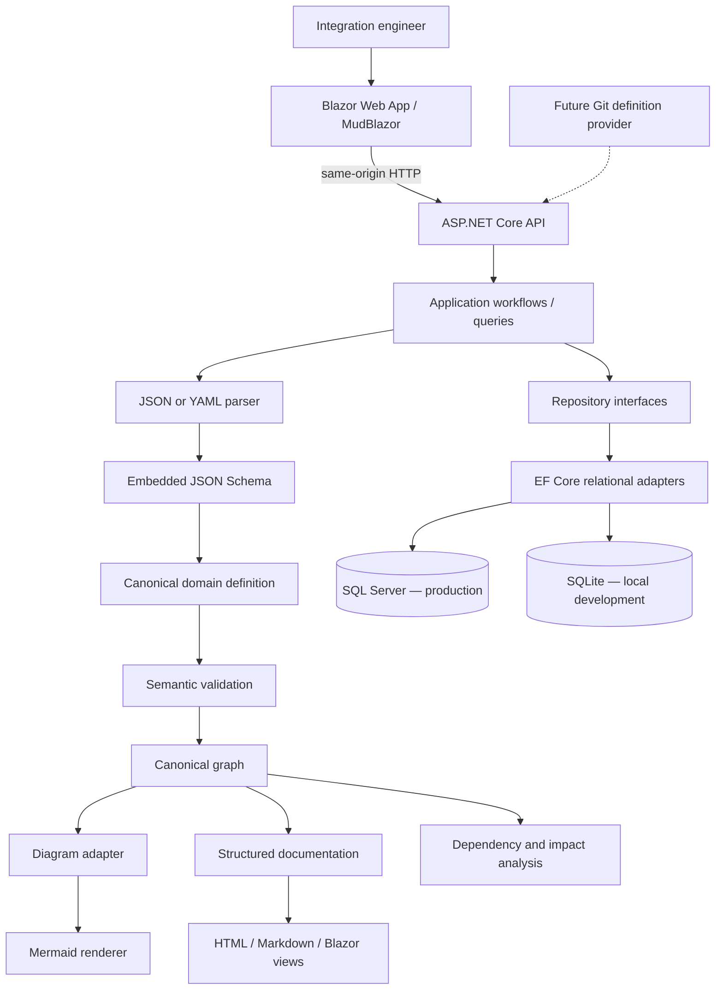
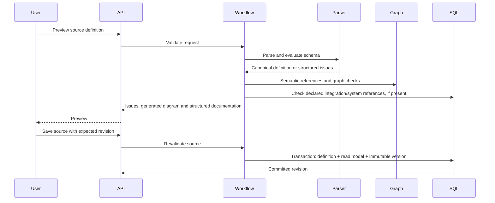

# Integration Documentation Runtime

The authoring definition is the source of truth. The canonical model is the runtime source. SQL Server maintains the production query/read model; local development uses persistent SQLite. Diagrams and documentation are derived artifacts and cannot be independently edited.

## Module and dependency boundaries

One ASP.NET Core process hosts API endpoints and the Blazor UI. `Web` is a Razor class library containing the Blazor Web App root; `Api` is its composition root and executable host. This keeps deployment simple and avoids separate origin, CORS, token relay and hosting concerns. Browser requests go through the API using the current user's authenticated cookie. Web references Contracts, never Infrastructure. Domain has no package dependencies.

| Project | Responsibilities |
| --- | --- |
| Domain | Immutable definitions, integration ID value object, enums, graph structure, traversal, semantic graph validation |
| Contracts | Typed API request and response models and wire serialization |
| Application | Import workflow, command/query coordination, documentation and diagram adapters, global graph and impact services |
| Infrastructure | Schema, bounded JSON/YAML parsing, canonical serialization, EF Core mappings, SQL search and repositories |
| Api | HTTP routing, authorization, CSRF, exception mapping, OpenAPI, health, composition |
| Web | MudBlazor pages and shared view components, authenticated same-origin API client |

Use cases call explicit services. There is no mediator framework, generic repository, external search engine, message broker, LLM, or microservice deployment.

## Definition language and canonical model

The root is `integration`. All relationships use node **IDs**, including message producers and consumers; display names are not identities. Node types are enums; future/custom components use `type: Custom` plus `customType`. Nested logical groups reference a parent group ID. Nodes may be optional and may contain runtime resource references, but no runtime health is inferred from configuration.

`systemId` references a registered enterprise system. `sharedResourceId` identifies shared infrastructure across definitions. Authors must use globally unambiguous values, including environment where relevant, e.g. `production:namespace:topic`. Nodes with neither identity are local to their integration.

The schema is strict: unknown properties, null collections, invalid enums and unexpected types fail. Limits bound definitions to 1 MB, 64 nesting levels, 2,000 nodes and 5,000 edges. YAML supports the same model as JSON. Plain YAML version scalars become strings, and booleans remain booleans. Aliases, anchors used through aliases, explicit YAML tags, multiple documents, duplicate JSON/YAML keys and complex mapping keys are rejected. This is a deliberate human-readable subset, not a general YAML execution surface.

## Import and validation

Issues distinguish Syntax, Schema and Semantic levels. Missing nodes/messages/systems/dependencies, duplicate identities and group cycles are errors. Disconnected components, orphan nodes, self-edges, flow cycles, multiple roots, missing inferred boundaries and declared dependency cycles are warnings. Warnings permit save. A user can explicitly declare sources and destinations for cyclic flows. Definition validation requires database access only for cross-definition references; a standalone preview can run while SQL Server is unavailable.

## Graph and traversal

The graph contains nodes, directed edges, entry/exit IDs, undirected connected components, logical groups and declared integration dependencies. It is never assumed to be a list or DAG. Bidirectional relationships produce two traversal arcs. Breadth-first traversal uses a visited set and excludes the starting node from its results. Cycle detection uses an iterative indegree algorithm; long chains do not consume the call stack.

Global IDs are namespaced:

- `system:<registered-id>` for enterprise systems.
- `resource:<shared-resource-id>` for infrastructure explicitly shared by authors.
- `node:<integration-id>:<node-id>` for local components.
- `message:<message-name>` for message producer/consumer relationships.
- `integration:<integration-id>` for declared integration dependencies.

Equal message names are treated as one catalogue concept; their per-integration versions and payloads remain separate occurrences. Use namespaced message names when two contracts are unrelated. Component membership is metadata, not a flow edge: adding edges between every integration and every member would fabricate causal paths.

Impact returns upstream/downstream components, directly participating integrations, transitively affected integrations and downstream systems. Declared dependency expansion is a separate traversal. Component impact follows documented flow and message edges; integration impact follows explicit inter-integration dependencies. This is architectural reachability, not a prediction of runtime failure or resilience. Optional nodes are retained in the graph; callers can see that they are optional in the definition.

## Persistence and history

`IntegrationEntity` stores current authoring text, format, SHA-256 source hash, canonical JSON snapshot, searchable scalar fields, validation issues, created/updated timestamps and revision. Canonical JSON is separate from raw authoring text; it preserves full optional metadata. Nodes, edges, tags, messages and occurrences, repositories, runbooks, registered systems, dependencies and immutable definition versions have relational tables. SQL search queries those columns and relationships without reparsing raw source. Indexes cover primary identities, lifecycle/domain, shared resources and update time. UTC timestamps persist as ticks through an EF conversion for consistent ordering across providers.

Saving uses a serializable transaction and an integer revision concurrency token. Updates replace the current relational children atomically and append a version containing both source and canonical snapshots. The route ID must equal the definition ID. Every update requires `expectedRevision`. Duplicate IDs and stale edits return 409. Deletion is archival: current catalogue queries hide the record while versions survive. Active incoming dependencies block archival. System removal is blocked when current or archived node records reference it. Archived IDs cannot be reused.

SQL Server migrations remain explicit. SQLite Development startup creates an empty file database when needed and applies pending SQLite migrations. Neither provider resets databases or seeds records. `DatabaseOptions` validates the provider and environment, resolves SQLite file paths against the API content root and enables foreign keys. `SqliteHubDbContext` inherits the common mappings but has its own migrations and snapshot, while `HubDbContext` retains SQL Server migrations. The `--migrate` mode applies migrations for the configured provider and exits. SQLite and its startup initialization are limited to Development/Testing; production requires SQL Server. Production database permissions should prohibit history updates/deletes for the runtime account, and backups/retention remain operational responsibilities.

## Rendering and UI

`IDiagramGenerator` consumes only the canonical graph. Mermaid uses generated safe IDs, encoded labels, strict rendering, and no author-supplied click directives or raw diagram editing. Node shapes express databases, queues and transformations. Logical groups become nested subgraphs; async edges and optional nodes have distinct styles. The pinned renderer is served locally.

`IIntegrationDocumentationGenerator` produces a structured view model before rendering. HTML and Markdown encode definition text. Razor also encodes text. No user HTML is interpreted. HTML export includes the Mermaid source as text; the interactive UI renders the visual diagram. PDF is a future rendering adapter.

The dashboard uses database aggregates, never synthetic activity or health. Catalogues have empty states. The editor clears its preview when source changes, prevents save until that exact text validates, and the server revalidates on every save. Version history exposes prior source. Monitoring tabs label configuration as metadata and runtime status as unknown.

## Security and operations

Entra configuration uses OIDC authorization code + PKCE for browser login and JWT bearer validation for API automation. Cookie API requests do not redirect to HTML login pages. Named Viewer/Editor/Admin policies enforce access at the API. OIDC and JWT use the `roles` claim. No token is stored in browser local storage. Cookie writes require antiforgery tokens; bearer writes use audience/issuer validated tokens. Actor identity is taken from authenticated claims, never a client author field.

Development authentication grants a configurable local role only in Development or Testing. It fails at startup in other environments. Production requires real Entra configuration and HTTPS. Persist Data Protection keys across deployments. Configure trusted reverse-proxy forwarding and TLS according to the target deployment; the application does not blindly trust forwarded identity or protocol headers.

Central exception handling returns RFC ProblemDetails and trace IDs. Application logs contain identities, counts, operation names and exception types, not raw definitions or sensitive payloads. `/health/live` does not touch SQL; `/health/ready` and `/health` check the selected database, pending migrations and catalogue schema. Standard ASP.NET logging and tracing are compatible with a later Application Insights provider; no live telemetry collector is installed.

## Verification and evolution

Tests cover graph shapes and long/cyclic traversal, safe rendering, schema parsing, version immutability, relational mapping, search, import workflow, HTTP errors, CSRF and authorization. SQLite is used for local development and relational contract tests; the production provider remains SQL Server. API tests create temporary file databases through the actual provider selection and startup migration path. Restart tests verify that definitions and history survive a new service scope and repeated migration application. SQL Server migration/application behavior must additionally be checked on a real SQL Server instance before production rollout.

The current global graph is built on demand from all active canonical snapshots. This is intentionally simple for gradual adoption. For very large estates, measure graph latency and memory, add revision-aware graph caching or relational projections behind the existing interfaces, and introduce message/system pagination. SQL substring search is parameterized but is not a full-text search index. There is no cache invalidation or distributed coordination to operate initially.

Future adapters can provide Git imports, PlantUML/React Flow rendering, PDF, full-text search and runtime telemetry without changing the definition/graph boundary. Any future AI feature should retrieve canonical facts and cite definitions rather than author its own architecture.

## Independent component discovery

A second authoring path stores versioned `ComponentDefinition` records containing exposed HTTP `endpoints`, outbound `calls`, commands in `sends`, events in `publishes`, and broker `consumes` bindings. The strict component JSON Schema also validates YAML after safe conversion. `ComponentWorkflow` validates, previews catalogue effects and saves through `IComponentRepository`; additive provider-specific migrations create `Components` and `ComponentVersions`.

`ComponentDiscovery` is a deterministic, side-effect-free resolver. It indexes matching routes by environment, contract/version/type and channel, applies payload assertions and explicit selectors, reports ambiguous or unresolved bindings, and projects connected networks into canonical integration definitions. The existing graph, Mermaid and documentation adapters render these projections. Generated networks are query results, not saved integration rows. Global dependency analysis adds these components under `component:` identities and routes discovered integration references through a separate namespace.

See [ADR 008](adr/008-component-message-discovery.md) and the [component discovery guide](component-discovery.md) for identity, concurrency, delivery semantics, lifecycle and limits.
